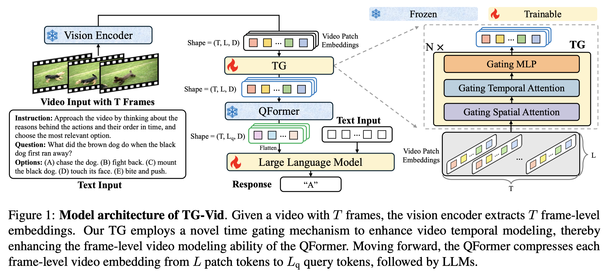

<h2 align="center"> <a href="https://arxiv.org/abs/2410.05714">Enhancing Temporal Modeling of Video LLMs via Time Gating</a></h2>

<h5 align=center>

[](https://huggingface.co/HenryHZY/TG-Vid-197K)
[](https://huggingface.co/HenryHZY/TG-Vid-220K)
[](https://arxiv.org/abs/2410.05714)
</h5>

<p align="center">

</p>


## Installation

Clone this repository and install packages:

```bash
git clone https://github.com/LaVi-Lab/TG-Vid.git
cd TG-Vid
conda create --name tg python=3.10
conda activate tg
pip install -r requirement.txt
```

## Data & Weight Preparation
- Annotation json files for training and testing are provided in [Huggingface](https://huggingface.co/datasets/HenryHZY/Data-TG-Vid). 

  Please download the corresponding videos from their official websites.

- Download the pretrained model weights:

  | Pretrained Model Weight                      | Download Link                                                |
  | -------------------------- | ------------------------------------------------------------ |
  | lmsys/vicuna-7b-v1.1 | [Huggingface](https://huggingface.co/lmsys/vicuna-7b-v1.1) |
  | EVA ViT-g | [Link](https://storage.googleapis.com/sfr-vision-language-research/LAVIS/models/BLIP2/eva_vit_g.pth) |
  | QFormer | [Link](https://storage.googleapis.com/sfr-vision-language-research/LAVIS/models/InstructBLIP/instruct_blip_vicuna7b_trimmed.pth) |

-  Note: you have to modify the path to data & pretrained model weights in the scripts & codes & configs. The easiest way is to search for `/path/to/`.


## Training

For quick usage, we have provided the checkpoints of TG-Vid-197K and TG-Vid-220K as follows:

| Model                      | Download Link                                                |
| -------------------------- | ------------------------------------------------------------ |
| TG-Vid-197K                          | [Huggingface](https://huggingface.co/HenryHZY/TG-Vid-197K) |
| TG-Vid-220K                           | [Huggingface](https://huggingface.co/HenryHZY/TG-Vid-220K) |

If you want to reproduce the training of TG-Vid, you can follow the following scripts:

Note: We use an AWS-like platform (e.g., mmengine.fileio) to store the training videos (`stllm/datasets/datasets/image_video_itdatasets.py, has_client = True`). If you store the training videos locally, please refer to [ST-LLM](https://github.com/TencentARC/ST-LLM/blob/main/trainval.md).

### TG-Vid-197K

```
CUDA_VISIBLE_DEVICES=0,1,2,3,4,5,6,7 bash script/train/train.sh TG-Vid-197K
```

### TG-Vid-220K

```
CUDA_VISIBLE_DEVICES=0,1,2,3,4,5,6,7 bash script/train/train.sh TG-Vid-220K
```

## Testing
Check inference/*/test_*.sh for more details:
```
  model=$1
  gpu=$2
  output="test_output/mvbench/${model}/"
  mkdir -p $output
  ...
  --cfg-path config/$model.yaml \
  --ckpt-path output/${model}/pytorch_model.bin \
  ...
```

Take `model=TG-Vid-197K` as an example:

### MVBench
```
bash script/inference/mvbench/test_mvbench.sh TG-Vid-197K 0
```

### TempCompass
```
bash script/inference/tempcompass/test_tempcompass.sh TG-Vid-197K 0
```

### NextQA Val
```
bash script/inference/nextqa/test_nextqa.sh TG-Vid-197K 0
```

### NextQA ATP-Hard
```
bash script/inference/nextqa_atp_hard/test_nextqa_atp_hard.sh TG-Vid-197K 0
```


## Citation
If you find this repo useful, please consider citing our paper:
```
@article{hu2024tgvid,
  title={Enhancing Temporal Modeling of Video LLMs via Time Gating},
  author={Zi-Yuan Hu, Yiwu Zhong, Shijia Huang, Michael R. Lyu and Liwei Wang},
  journal={arXiv preprint arXiv:2410.05714},
  year={2024}
}
```

## Acknowledgement
* [MVBench](https://github.com/OpenGVLab/Ask-Anything/tree/main/video_chat2) and [ST-LLM](https://github.com/farewellthree/ST-LLM): The codebase we built upon.
